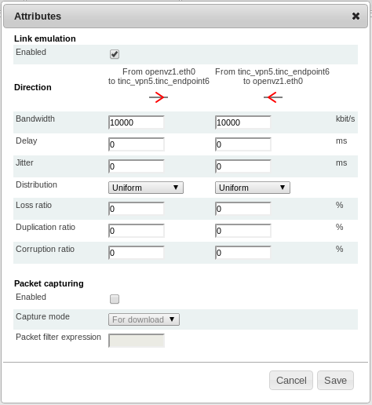

Link Emulation
==============

Link emulation is an important feature for some experiments. Link emulation means that conditions of real networks and their effects on traffic are emulated in an environment with different conditions.

ToMaTo supports an extended set of link characteristics based on the tc/netem capabilities. With ToMaTo, users can add *packet loss*, *packet duplication*, *packet corruption*, *delay*, and *bandwith limitation* to existing connections. These conditions are applied to the data that flows over the connection additionally to the conditions that it already possesses. The conditions can be set separately on each direction of a conection. The emulated conditions can be changed any time (even on running connectors) in the graphical editor.

Mode of operation
-----------------

To emulate the link characteristics ToMaTo uses two combined queues per direction. The queues for the different directions of the connection are completely independent.

The first queue each packet has to go through is a netem queue that emulates all link characteristics except bandwidth limitations. This queue delays packets, drops them depending on the loss and emulates duplication and corruption. Packets that exit this queue (after being delayed) are processed by the second queue.

A token-bucket-filter queue is used as the second queue to enforce bandwidth limitations. Tokens are produced with a fixed rate limited to a certain maximum. If there are tokens left, packets are sent immediately and the tokens are reduced. Otherwise the packets are put on hold and delayed until enough tokens have been produced.

.. note:: 
    **A note on buffering**

    Both queues need buffers for their normal execution. The netem queue needs the buffer to store packets that have to be delayed and the TBF queue needs the buffer to store packets until enough tokens are ready to send them. ToMaTo tries to automatically calculate good values for these buffers.

    The TBF buffer is sized so that 25ms of data (at the maximal rate) can be buffered. This should be enough to actually reach the maximal rate. The minimal buffer size is one MTU of 1540 bytes.

    The netem buffer is sized so that enough packets of an average size of 250 bytes can be delayed by the configured delay to reach the configured maximal bandwidth without causing loss.

.. note::
    **A note on transitions**

    Due to technical restrictions changes to the link emulation settings can only be applied in two steps: First the token bucket filter is changed to apply the new bandwidth settings, which results in the Netem queue being temporarily removed. After this the Netem queue that does all the other link emulation is reestablished.

    Because of this two-step process there is a short gap between these steps where only the bandwidth is enforced but the delay, loss, etc. are not applied and the link has perfect properties. In most cases this gap is too short to be noticeable but sometimes, depending on load, scheduling can result in the gap length rising to about 10ms (The length of a scheduler time slice).

Bandwidth limitations
---------------------

Bandwidth limitations can be set on connections to limit the maximal data rate. The bandwidth limitation must be configured in kilobits per second. The default bandwidth limitation for all connections (if no limit is configured) is 10 MBits.

Note that due to the token bucket filter short bursts can have a higher effective bandwidth than the configured limit but the sustained bandwidth is limited by the configured maximum.

Also note that traffic that exceeds the limit first fills the buffers and then is dropped if the buffers are full. See above for an explanation of the buffer sizes.

Delay
-----

If delay is configured for a connection, packets on that connection are stored in a queue and sent when they are due. The timing granularity depends on the capabilities of the realtime clock of the hosts but in general is very precise. Delays must be configured in milliseconds.

Note that delays are only added to the connection and that other delays like processing delays and real transmission delays add to the configured delay.

Jitter
------

Jitter can be applied as a random modification of the delay per packet. The jitter value must be configured in milliseconds and configures the delay by which the configured delay can be increased or reduced per packet. The way jitter is calculated depends on the chosen distribution.

Note that jitter can cause packets to be reordered if the jitter value has the same order of magnitude as the time between two packets.

Note that if the jitter is higher than the delay all resulting negative per packet delays are treated as zero delay.

Delay distribution
------------------

The delay jitter can be allied with a _uniform_ distribution meaning that all values in the jitter range are equally likely (this is the default).

The _normal_ distribution has a higher probability for values near the configured delay but is still symmectric for values higher and lower than the configured delay.

The _pareto_ distribution follows a power law where most of the delays are a little lower than the configured delay and some delays are much higher.

The _paretonormal_ distribution is a mixture of both distributions with 75% pareto and 25% normal distribution.

Note that only the uniform distribution guarantees that the per packet delay will be in [delay-jitter .. delay+jitter] and that the median of the pareto distribution is lower than the configured delay

.. figure:: images/delay_distributions.*

   Different delay distributions with delay=50ms and jitter=10ms

Packet loss
-----------

Packet loss in ToMaTo in applied as a per-packet probability. This means that for a 20% loss ratio there is no guarantee that one of 5 packets gets lost or that at most one of two packets gets lost. It might take a lot of packets until the number of lost packages is somewhere near to 20%. Packet loss is configured in percent, thus 20% is represented as 20 (not 0.2).

Loss correlation
****************

Packet loss can optionally be correlated. That means that the loss probability of a packet depends on the loss probability of the packet before. The loss correlation is configured in percent like the loss probability.

Packet duplication
------------------

If a packet duplication probability is configured, packets are duplicated with that probability. That means that an exact copy of the packet is constructed and send directly after it. Duplication will create one copy at maximum.

Note that since the packets first pass the duplication and then the rate limiting duplicated packets count twice on the bandwidth usage.

Packet corruption
-----------------

If a packet corruption probability is configured, packets are corrupted with that probability. That means that a bit at a random position in the packet is flipped. Corruption will flip at most one bit in a packet.

Note that in most cases checksums of the underlying layers prevent corrupted packets to be seen on higher layers.

Physical link statistics
------------------------

As said before, the link emulation applies additionally to the existing conditions on the underlying links. To set up an experiment it is important to estimate these conditions. ToMaTo supports this by running periodic checks to measure delay and packet loss between all sites. The averages of these measurements can be viewed in the web-frontend in the admin section (accessible by all users).

Other link emulation possibilities
----------------------------------

If you need more that the built-in link emulation of ToMaTo you can use a KVM machine as the center of the network and add a link emulation software with your emulation rules.

Another way to do link emulation in ToMaTo is to use an entity outside ToMaTo (on a physical host) to do the link emulation and to get access to it via external network connectors.